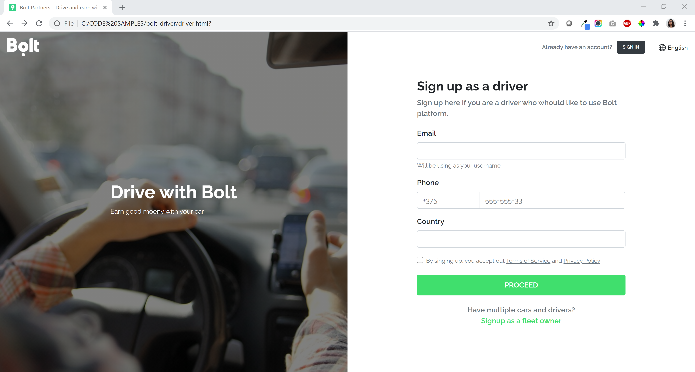
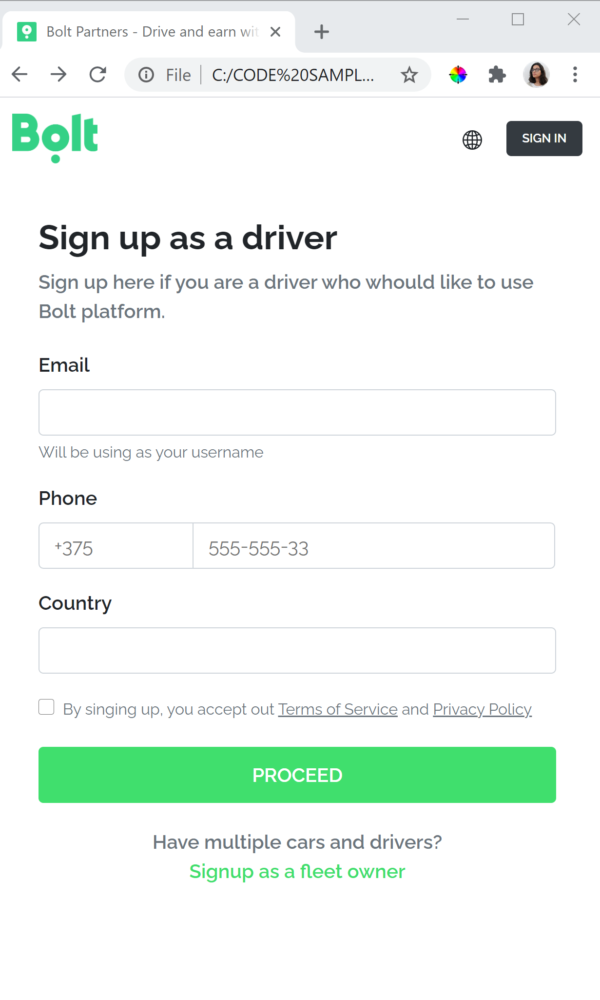

# Bolt - Driver

This is a mock web page created to let drivers Signup as Bolt drivers. 

## Made with:

* Bootstrap 4.5.3
* HTML
* CSS
* Basic Javascript for validations

## Side notes:
* All links are functional, except language.
* I changed "Taxify" references to "Bolt", cause my understanding is that what we used to know as "Taxify" is now "Bolt".
* Bolt logo on header is an .svg file
* Added seo tags: Social - Title - Description
* Added favicon
* Fonts are beign loaded from google fonts CDN. I am using raleway cause I think is the font used on the image reference provided.
* Bootstrap is beign loaded from CDN
* Tested on Chrome, Safari, Firefox and Edge

Output for Desktop:

[<kbd></kbd>](bolt-driver/static/images/readme/desktop.png)

Output for Mobile:

[<kbd></kbd>](bolt-driver/static/images/readme/mobile.png)